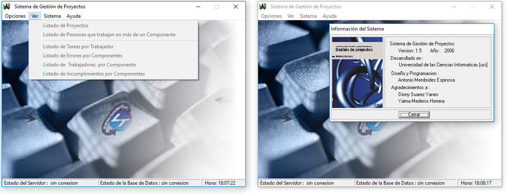

# demo.c
This repository contains a list of demonstration applications. The demo applications have as a common factor the use of technologies based on C/C++. Note that most of the published source code is for academic purposes.


## IPC Demos 
It is a set of demonstration applications written on C++, that reflect the use of parallel programming techniques. [For more information read here](ipc_demos/docs/programacion.paralela-Lectores.Escritores.pdf)

## QT Psql lay
It is a C++ simple data access layer for the Qt framework for PostgreSQL database manipulation.

## QT QHashList
It is a C++ library that allows creating an abstraction layer to use hash lists and index elements using semantic keys.

```c++
	QHashList<Person*> list = new QHashList<Person*>();

	list->add(new Person("Juan",  23), "juan");
	list->add(new Person("Julia", 12), "julia");
	list->add(new Person("johan", 50), "johan");

	Person* juanObj = (*list)["juan"];
	Person* juanObj = (*list)[0];
```


## QT QXmlMetaReader
Define an abstraction layer that allows reading an xml in the form of an associative array, the keys are VALUE: value, ATTRI: value of a certain property, CHILD: list of child elements.

### source
```xml
	<root inf = "roots-inf"> 
		<tmp inf = "r2.0" value="tmp-val1"> data1 </tmp>
		<tmp inf = "tmp-val2"		  > data2 </tmp>
		<tst val = "mist"> 
			<tm1> tm1A </tm1>
			<tm1> tm1B </tm1>
			<tm1> tm1C </tm1>
			<tm1> tm1D </tm1>
		</tst>
	</root>
```
### manage with QXmlMetaReader
```c++
	QXmlMetaReader reader("lconfig.xml");
	qDebug() << "CHILDR--->:" << reader[VALUE];
	qDebug() << "ATTRIR--->:" << reader[ATTRI]["inf"];

	qDebug() << "VALUE---->:" << reader["tst"][0][VALUE];
	qDebug() << "ATTRI---->:" << reader["tst"][0][ATTRI]["val"];

	for(int i=0; i< reader["tst"][0][CHILD]["tm1"].count(); i++)
		qDebug() << "CHILD---->:" << reader["tst"][0][CHILD]["tm1"][i][VALUE];
```

## QT SIR App
It is a system developed using an architecture based on components or plugins, where each plugin represents a compiled C ++ library with .so extension for GNU/Linux systems and dll for Windows systems. It features a dynamic loading mechanism for compiled libraries.

## SGP Desktop
It is a system for the management of computer projects, focused on the management of tasks, errors, and workers by components. It presents a database management mechanism. Developed with the Borland C++ Builder IDE.




### Similar projects 
+ [JavaScript: Demo applications written in JavaScript ](https://github.com/ameksike/demo.javascript)
+ [PHP: Demo applications written in PHP ](https://github.com/ameksike/demo.php)
+ [Python: Demo applications written in Python ](https://github.com/ameksike/demo.python)
+ [C/C++: Demo applications written in C/C++ ](https://github.com/ameksike/demo.c)
+ [CoffeeCup: Demo applications written in Java ](https://github.com/ameksike/demo.java)
+ [Dot.Net: Demo applications focused on  Microsoft .Net Platform ](https://github.com/ameksike/demo.ms.net)
+ [CLI: Shell scripts focused on Command Line Interface ](https://github.com/ameksike/demo.cli)
+ [Maps: Demo applications focused on Geographic Information Systems (GIS)](https://github.com/ameksike/demo.map)


